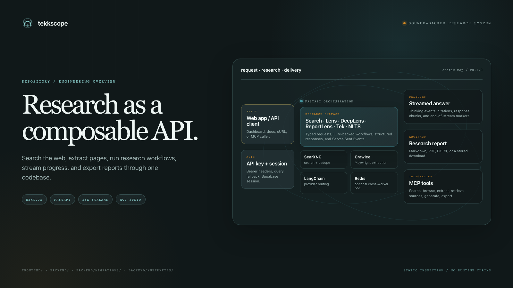
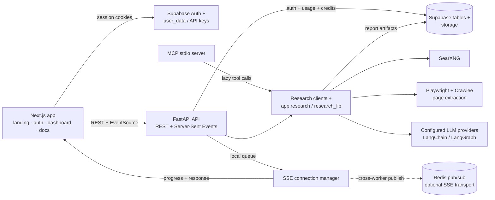
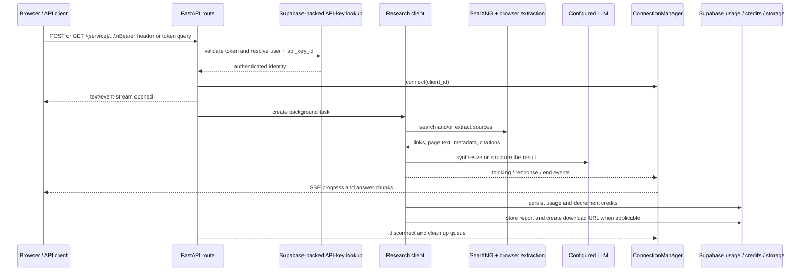
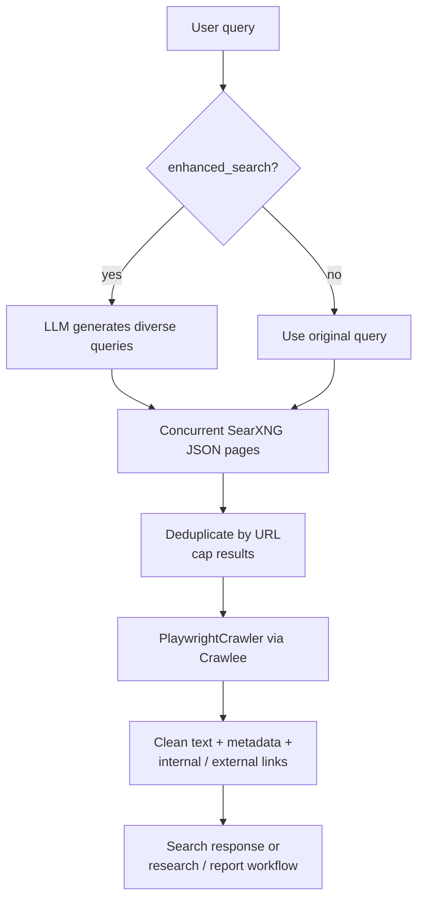
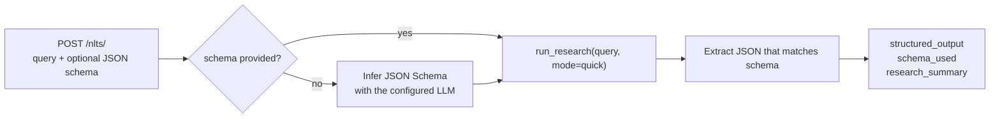

<p align="center">
  
</p>

# Tekkscope

Source-backed web research and search exposed through a Next.js dashboard, a FastAPI API, streamed workflows, report exports, and a dependency-light MCP server.

## What is in the repository

| Surface | What it provides | Code anchor |
| --- | --- | --- |
| Web app | Landing page, Supabase-authenticated onboarding, dashboard, playground, API-key management, usage, billing, settings, and API docs | [`frontend/app/`](frontend/app/) |
| Research API | Typed FastAPI routes for search, Lens, DeepLens, ReportLens, Tek, NLTS, and API-key management | [`backend/app/main.py`](backend/app/main.py) |
| Retrieval | SearXNG search, optional LLM query expansion, URL deduplication, and Playwright/Crawlee page extraction | [`backend/app/clients/search.py`](backend/app/clients/search.py) · [`backend/app/clients/scraper.py`](backend/app/clients/scraper.py) |
| Streaming | Server-Sent Events backed by local `asyncio` queues, with optional Redis pub/sub for cross-worker delivery | [`backend/app/streaming.py`](backend/app/streaming.py) |
| Research workflows | Quick summaries, detailed research, report generation, chat/tool orchestration, and natural-language-to-structured JSON | [`backend/app/clients/`](backend/app/clients/) |
| MCP | JSON-RPC over stdio tools for search, browsing, extraction, saved sources, report generation, and report export | [`backend/app/mcp_server.py`](backend/app/mcp_server.py) |

## High-level architecture



The browser-facing app owns session-aware UI and server routes for Supabase-backed account data. The Python service owns search, research, scraping, report generation, API-key validation, usage accounting, and streamed responses. Redis is an optional transport layer: local queue delivery remains available when it is disabled or unavailable.

## Detailed system flows

### Research request and streamed response

Lens, DeepLens, ReportLens, Tek, and content-search streaming endpoints follow the same broad runtime shape: authenticate a request, open a per-client queue, launch the work, then emit progress and response events as Server-Sent Events.



The API accepts Bearer credentials on authenticated routes; legacy EventSource clients can also pass `token` in the query string through `validate_token_query`. The frontend playground consumes thinking, response, citation, download, and end-of-stream events in [`PlaygroundContext.jsx`](frontend/app/contexts/PlaygroundContext.jsx).

### Search and retrieval pipeline



`POST /search/links` stops after link search. `/search/content` and `/search/content/stream` continue into content extraction; research clients reuse the same SearXNG and scraper primitives.

### Natural language to structured JSON



## Key components

| Component | Responsibility | Entry points |
| --- | --- | --- |
| `app.main` | Creates the FastAPI app, request IDs, CORS, health/readiness probes, and route registration | `/`, `/healthz`, `/ready` |
| `app.routers.search` | Link search and streamed content extraction | `/search/links`, `/search/content`, `/search/content/stream` |
| `app.routers.lens` / `deeplens` / `reportlens` | Quick research, detailed research, and report-oriented research, each with structured and streamed routes | `/lens/*`, `/deeplens/*`, `/reportlens/*` |
| `app.routers.tek` | Chat completion and streamed chat through a LangGraph tool-calling workflow | `/tek/chat-completion`, `/tek/chat-completion/stream` |
| `app.routers.nlts` | Natural-language-to-structured output with an optional caller-provided schema | `/nlts/` |
| `app.streaming.ConnectionManager` | Per-user queues, bounded delivery, Redis publish/listen, message de-duplication, and cleanup | [`backend/app/streaming.py`](backend/app/streaming.py) |
| `app.auth` + Supabase | API-key hashing/masking, Bearer validation, legacy lookup fallback, and ownership checks | [`backend/app/auth/`](backend/app/auth/) |
| Report utilities | Markdown-to-PDF, Markdown-to-DOCX, and Markdown passthrough | [`backend/app/utils/report_generator.py`](backend/app/utils/report_generator.py) |

### API surface

| Capability | Structured endpoint | Stream endpoint | Auth path |
| --- | --- | --- | --- |
| Search links | `POST /search/links` | — | no dependency in the route; clients may still send a key |
| Search content | — | `GET /search/content` or `/search/content/stream` | Bearer header or `token` query |
| Lens | `POST /lens/research` | `GET /lens/research/stream` | Bearer header or `token` query |
| DeepLens | `POST /deeplens/research` | `GET /deeplens/research/stream` | Bearer header or `token` query |
| ReportLens | `POST /reportlens/research` | `GET /reportlens/research/stream` | Bearer header or `token` query |
| Tek | `POST /tek/chat-completion` | `GET /tek/chat-completion/stream` | Bearer header or `token` query |
| NLTS | `POST /nlts/` | — | no route dependency in the current router |
| API keys | `POST /api-keys`, `GET /api-keys`, `DELETE /api-keys/{api_key_id}` | — | Bearer header |

ReportLens accepts `file_format` values `pdf`, `docx`, or `md`; its `quality` parameter normalizes to `standard` or `deep` before the report task starts.

## Tech stack

| Layer | Technologies evidenced in the repository |
| --- | --- |
| Frontend | Next.js `16.0.3`, React `19.2.0`, TypeScript, Tailwind CSS v4, Radix UI primitives, Framer Motion / GSAP, Recharts, React Markdown + KaTeX |
| API | Python `>=3.11,<3.14`, FastAPI, Uvicorn, Pydantic / pydantic-settings, HTTPX, Loguru |
| Research + agents | `local-deep-research`, `app/research_lib`, LangChain integrations for OpenAI, Google Gemini, Anthropic, and LangGraph tool graphs |
| Search + extraction | SearXNG, `httpx`, Crawlee, Playwright, BeautifulSoup, DuckDuckGo Search dependency |
| Persistence + identity | Supabase Auth / Postgres-facing tables / Storage, API-key and usage tables, credit balances |
| Streaming + deployment | asyncio queues, optional Redis 5 pub/sub, Docker, Kubernetes manifests, GitHub Actions |
| Documents | `reportlab`, `python-docx`, `markdown2`; PDF, DOCX, and Markdown report outputs |

## Repository structure

```text
.
├── frontend/
│   ├── app/
│   │   ├── (landing-page)/       # public landing and legal pages
│   │   ├── api/                  # Next.js server routes for auth/account data
│   │   ├── authentication/       # sign-in surface
│   │   ├── dashboard/            # playground, API keys, usage, billing, settings
│   │   └── docs/v1/              # in-app API quickstart and endpoint docs
│   ├── Clients/supabase/         # browser, server, and middleware Supabase clients
│   └── components/               # shared UI primitives and dashboard components
├── backend/
│   ├── app/
│   │   ├── main.py               # FastAPI application entrypoint
│   │   ├── routers/              # public API route modules
│   │   ├── clients/              # search, scraping, Lens, reports, Tek, NLTS
│   │   ├── auth/                 # token validation and key helpers
│   │   ├── research_lib/         # embedded research/search/settings modules
│   │   └── utils/                # usage, rate limiting, report generation
│   ├── migrations/               # API-key hashing and usage metadata SQL
│   ├── kubernetes/               # backend, Redis, search-engine, and service manifests
│   ├── tests/                    # model, auth, MCP, streaming, and usage tests
│   ├── pyproject.toml            # Python package and tooling configuration
│   └── docker-compose.yml        # backend + Redis local composition
└── docs/assets/
    ├── readme-hero.html          # editable hero source
    └── readme-hero.png           # rendered README hero
```

## Setup and usage

This section mirrors the checked-in manifests and CI workflows. Populate local environment files with your own values; secret values are intentionally not documented here.

### Backend

The backend expects Python `>=3.11,<3.14`. The checked-in environment template names Supabase, LLM, SearXNG, Redis, streaming, CORS, search, and scrape settings.

```bash
cd backend
python3.11 -m venv .venv
source .venv/bin/activate
pip install -e ".[dev]"
cp .env.example .env
python -m uvicorn app.main:app --reload --port 8000
```

Required configuration is read from environment variables such as `SUPABASE_URL`, `SUPABASE_API_KEY`, `TEKK_LLM_PROVIDER`, `TEKK_LLM_MODEL`, `SEARXNG_URL`, and `REDIS_URL`. The runtime defaults Redis streaming to enabled but treats Redis as optional unless `TEKK_REDIS_READINESS_REQUIRED=true`.

### Frontend

The frontend CI workflow uses Node.js 20 and `npm ci`; the dev server is defined by the `dev` package script.

```bash
cd frontend
npm ci
npm run dev
```

Set `NEXT_PUBLIC_SUPABASE_URL`, `NEXT_PUBLIC_SUPABASE_ANON_KEY`, and `NEXT_PUBLIC_BACKEND_DOMAIN` for the browser app. Server-side account routes additionally use `SUPABASE_SERVICE_ROLE_KEY` and the API-key hashing path uses `TEKK_API_KEY_PEPPER`.

### Minimal API request

```bash
curl -X POST "http://localhost:8000/search/links" \
  -H "Content-Type: application/json" \
  -d '{"query":"latest advancements in AI","num_results":5}'
```

Authenticated routes use `Authorization: Bearer <api-key>`. Existing EventSource integrations can use the `token` query parameter; the backend explicitly prefers headers when both forms are present.

### Docker and deployment notes

`backend/docker-compose.yml` defines `tekkscope-backend` on port `8000` and a Redis service on `6379`; its comments note that the SearXNG/search-engine service is external to that local composition. Kubernetes manifests describe a non-root backend deployment, Redis, the search-engine service, and a load balancer. Production CD applies the backend and Redis manifests and pins the backend image to the CI commit.

## Relevant docs and checks

- [Frontend API quickstart](frontend/app/docs/v1/page.jsx)
- [Search API docs](frontend/app/docs/v1/search/page.jsx)
- [Lens docs](frontend/app/docs/v1/lens/page.jsx)
- [DeepLens docs](frontend/app/docs/v1/deeplens/page.jsx)
- [ReportLens docs](frontend/app/docs/v1/reportlens/page.jsx)
- [Tek docs](frontend/app/docs/v1/tek/page.jsx)
- [MCP server](backend/app/mcp_server.py)
- [Backend CI](backend/.github/workflows/ci.yml) · [Frontend CI/CD](frontend/.github/workflows/main.yml)
- [Kubernetes deployment notes](backend/kubernetes/README.md)
- [API-key hashing migration](backend/migrations/001_api_key_hashing.sql) · [Usage metadata migration](backend/migrations/002_usage_metadata.sql)

The repository contains tests for request-model bounds, API-key hashing/masking, MCP URL validation, local streaming delivery, and usage accounting in [`backend/tests/`](backend/tests/). No repository-backed performance benchmark is documented here, so this README intentionally does not present throughput, latency, or accuracy numbers.
